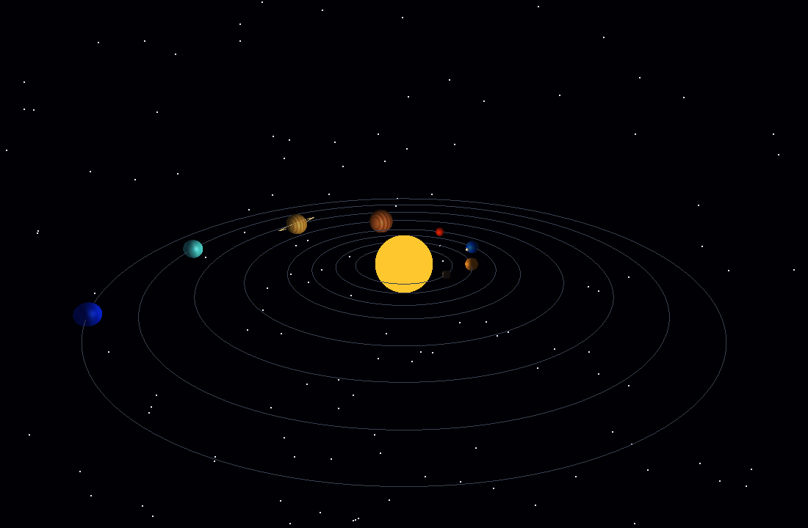

# Sistema Solar 3D — Projeto Final de Computação Gráfica

Projeto desenvolvido em **C++ com OpenGL 2.1, GLU e GLUT** para a disciplina de Computação Gráfica.

## Integrantes

- Gabriel Rafá Martins Freire — 20230145310
- Tobias Freire Numeriano — 20230012378
- Pedro Henrique de Araujo Lima — 20220005950

## O que o programa faz

O programa apresenta uma simulação 3D didática do Sistema Solar com:

- Sol e oito planetas;
- rotação dos planetas e translação em torno do Sol;
- Lua orbitando a Terra por transformação hierárquica;
- anéis de Saturno;
- câmera 3D controlável pelo teclado;
- passeio automático de câmera usando uma curva cúbica de Bézier;
- iluminação posicional com o Sol como fonte de luz;
- sombreamento suave;
- texturas procedurais aplicadas aos planetas;
- z-buffer para resolver corretamente a oclusão;
- órbitas e campo de estrelas;
- controles para pausar, acelerar e ligar/desligar luz, textura e órbitas;
- captura de tela da aplicação.

> As escalas de tamanho, distância e velocidade foram adaptadas para fins didáticos e de visualização. Elas não representam proporções astronômicas reais.

## Imagem do programa



## Estrutura do projeto

```text
.
├── .gitignore
├── Makefile
├── README.md
├── Instrucoes_Projeto_CG_2026-1.pptx.pdf
├── src/
│   ├── main.cpp
│   ├── engine.cpp
│   ├── render.cpp
│   ├── input.cpp
│   └── sistema_solar.hpp
├── docs/
│   ├── screenshot.png
│   ├── roteiro_falas_apresentacao.md
│   └── checklist_entrega.md
└── scripts/
    └── ppm_para_png.sh
```

O executável `sistema_solar` é gerado por `make` e, por isso, está listado no `.gitignore`.

## Dependências

### Fedora

```bash
sudo dnf install gcc-c++ freeglut-devel mesa-libGLU-devel
```

### Ubuntu / Debian

```bash
sudo apt update
sudo apt install build-essential freeglut3-dev libglu1-mesa-dev
```

## Como compilar

Na pasta raiz do projeto:

```bash
make
```

Ou diretamente:

```bash
g++ -std=c++11 -O2 -Wall -Wextra -pedantic \
    src/main.cpp src/engine.cpp src/render.cpp src/input.cpp \
    -o sistema_solar -lGL -lGLU -lglut
```

## Como executar

```bash
./sistema_solar
```

Também é possível usar:

```bash
make run
```

## Controles

| Tecla | Ação |
|---|---|
| Espaço | Pausa ou continua a animação |
| `+` / `-` | Aumenta ou diminui a velocidade da simulação |
| `1` | Câmera padrão |
| `2` | Câmera vista de cima |
| `3` | Câmera aproximada |
| `C` | Ativa/desativa passeio automático por curva de Bézier |
| `L` | Ativa/desativa iluminação |
| `T` | Ativa/desativa texturas |
| `O` | Mostra/esconde as órbitas |
| `R` | Restaura câmera e velocidade |
| Setas | Gira a câmera manualmente |
| PageUp / PageDown | Aproxima/afasta a câmera |
| `P` | Salva uma captura em `screenshot.ppm` |
| `H` | Mostra os controles no terminal |
| Esc | Encerra o programa |

Para converter a captura PPM em PNG, com ImageMagick instalado:

```bash
./scripts/ppm_para_png.sh
```

Também existe um modo de captura automática útil para teste:

```bash
./sistema_solar --screenshot
```

## Onde alterar os parâmetros

Os parâmetros principais ficam concentrados na função `createPlanets()` em `src/engine.cpp`.

Cada planeta possui, nesta ordem:

```text
nome,
raio,
distancia_da_orbita,
velocidade_orbital,
velocidade_de_rotacao,
inclinacao_do_eixo,
cor_base,
cor_de_detalhe,
padrao_de_textura
```

Exemplo simplificado da Terra:

```cpp
planets.push_back({
    "Terra",
    0.58f,  // tamanho
    7.5f,   // distância ao Sol
    23.0f,  // velocidade orbital
    70.0f,  // velocidade de rotação
    23.5f,  // inclinação
    ...
});
```

Assim, é possível modificar o comportamento sem alterar a lógica do restante do programa.

## Organização e comentários do código

O código foi dividido em módulos e comentado para facilitar a leitura:

- `main.cpp`: criação da janela e registro dos callbacks GLUT;
- `engine.cpp`: dados da simulação, planetas, texturas, estrelas, Bézier e câmera;
- `render.cpp`: desenho da cena, iluminação, transformações e projeção;
- `input.cpp`: teclado, animação, captura e inicialização do OpenGL;
- `sistema_solar.hpp`: estruturas, constantes, estados globais e protótipos.

Os comentários destacam os conceitos de Computação Gráfica aplicados em cada bloco, sem comentar mecanicamente cada linha.

## Elementos das atividades práticas usados no projeto

### Prática 01 — Introdução ao OpenGL

- fluxo básico GLUT: `main`, `display`, `reshape`, callbacks de teclado e loop de eventos;
- primitivas OpenGL para órbitas, estrelas e anéis;
- double buffering com `GLUT_DOUBLE` e `glutSwapBuffers()`;
- interação por teclado.

### Prática 02 — Visualização 3D

- projeção perspectiva com `gluPerspective()`;
- câmera com `gluLookAt()`;
- translações e rotações 3D;
- uso de `glPushMatrix()` e `glPopMatrix()`;
- transformação hierárquica na relação Sol → Terra → Lua.

### Prática 03 — Transformações e visibilidade

- z-buffer habilitado com `GL_DEPTH_TEST`;
- limpeza simultânea de `GL_COLOR_BUFFER_BIT` e `GL_DEPTH_BUFFER_BIT`;
- oclusão correta entre Sol, planetas, Lua e anéis.

### Prática 04 — Iluminação e sombreamento

- `GL_LIGHTING` e `GL_LIGHT0`;
- fonte de luz posicional na origem, representando o Sol;
- componentes ambiente, difusa e especular;
- `GL_SMOOTH` para sombreamento suave;
- tecla `L` para comparar a cena com e sem iluminação.

### Prática 05 — Mapeamento de texturas

- criação de objetos de textura;
- `glBindTexture()` e `GL_TEXTURE_2D`;
- filtragem linear e mipmaps;
- coordenadas de textura na superfície esférica;
- texturas procedurais geradas pelo próprio código, evitando arquivos externos;
- tecla `T` para comparar objetos com e sem textura.

### Prática 06 — Curvas paramétricas

- curva cúbica de Bézier definida por quatro pontos de controle;
- avaliação da curva pela fórmula de Bernstein;
- câmera movimentada automaticamente ao longo da curva;
- tecla `C` para ativar/desativar o passeio.

## Principais problemas encontrados e soluções

### 1. Escalas astronômicas reais deixam a cena impraticável

As diferenças reais de tamanho e distância fariam os planetas praticamente desaparecerem. A solução foi usar uma escala didática, preservando a ordem dos planetas e diferenças relativas visuais.

### 2. Organizar várias transformações sem afetar os outros objetos

Rotações e translações se acumulam na matriz ModelView. O uso sistemático de `glPushMatrix()` e `glPopMatrix()` isola as transformações de cada planeta e permite criar a hierarquia da Lua em relação à Terra.

### 3. Objetos aparecendo na frente mesmo estando mais distantes

Sem teste de profundidade, a ordem de desenho poderia determinar incorretamente qual objeto ficaria visível. Foi habilitado o z-buffer com `GL_DEPTH_TEST`.

### 4. Combinar iluminação com texturas

Para que a textura continue visível e responda à luz, o projeto usa `GL_MODULATE`, normais suaves e `GL_COLOR_MATERIAL`.

### 5. Criar uma câmera automática suave

O passeio foi implementado com uma curva cúbica de Bézier. A posição da câmera é calculada continuamente pelo parâmetro `t`, enquanto `gluLookAt()` mantém o foco no centro do sistema.

## O que pode ser melhorado e como melhorar

- usar imagens reais de alta resolução dos planetas, carregadas de arquivos de textura;
- adicionar mais luas, cinturão de asteroides e cometas;
- usar órbitas elípticas e inclinações orbitais específicas;
- criar seleção de planetas e câmera focada em cada corpo;
- adicionar nomes dos planetas na interface;
- permitir editar parâmetros por arquivo de configuração;
- criar modos diferentes de escala astronômica e escala didática;
- implementar sombras mais avançadas e efeitos de atmosfera;
- migrar futuramente para OpenGL moderno com shaders, mantendo esta versão em OpenGL 2.1 para cumprir o requisito da disciplina.

## Divisão de responsabilidades do grupo

### Gabriel Rafá Martins Freire

- integração geral do projeto;
- estrutura da simulação e parâmetros dos planetas;
- transformações hierárquicas, animação orbital e controles de câmera;
- organização do código, documentação e testes finais.

### Tobias Freire Numeriano

- iluminação e sombreamento;
- texturas procedurais e aparência dos corpos;
- campo de estrelas e elementos visuais;
- testes dos controles de luz e textura.

### Pedro Henrique de Araujo Lima

- câmera automática por curva de Bézier;
- z-buffer, verificação de visibilidade e perspectivas de câmera;
- testes de interação e demonstração;
- apoio na preparação da apresentação.

## Apresentação

O professor definiu **15 minutos de apresentação + 5 minutos de perguntas**, com participação de todos os integrantes. O arquivo `docs/roteiro_falas_apresentacao.md` foi preparado para aproximadamente 15 minutos e inclui uma demonstração prática dos controles.

## Checklist antes da entrega/apresentação

O arquivo `docs/checklist_entrega.md` resume os requisitos do professor e os itens que devem ser conferidos pelo grupo antes do envio do link do repositório e da apresentação presencial.
